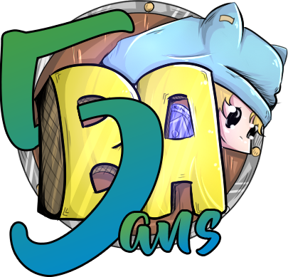

<!-- @format -->

  

 ### BATTLE TOFU | BattleAdventure

## Description du projet

Battle tofu a pour but d'amélioré et d'optimisé le site web et l'expérience utilisateur lié au serveur Minecraft [Battle-Aventure](https://www.battle-adventure.eu/)

# _Sommaire_

- ### Problématique
- ### Objectifs
- ### Solution proposé
- ### Valeurs ajoutées
- ### Technologies utilisées
- ### Conclusion et perspectives

---

## Problématique

Au vue du vieillissement du site comment pourrions nous lui offrir de nouvelle fonction ou optimisation ?

## Objectifs

Apporté de nouvelles fonctions tel que BA connect et l'optimisation des statistiques des joueurs.

## Solution proposé

A fin d'optimiser les mots de passe pour les utilisateurs entre le site web et celui du serveur nous proposons l'utilisation d'un "BA connect" qui permettra de relier le compte utilisateur site web à celui du serveur. Pour ce faire nous utilisons un <u>_peer-to-peer_</u> , le joueur pourra alors relier son compte minecraft avec le site web et de ce fait récupérer ses statistiques.

Suite à cela nous proposons une page de profil totalement revisité, elle permettra à l'utilisateur de retrouver ses informations tel que son pseudo mais la principal particularité est une visualisation des statistiques du joueur sous forme de block ainsi que des graphiques relevant les temps de jeu, kills et morts par jour et également la distance parcouru.

## Valeurs ajoutées

Nous avons également effectuer quelque changement mineurs au sein du site web, nous avons modifié les grades achetables par de nouveau car nous avons considérer que c'est derniers ressemblé à des classes de personnages et non des grades, de ce faite nous les avons remplacés par des grades basés sur des dofus qui est une référence direct a à l'univers de dofus, ils sont achetable dans l'ordre de leur rareté.
Voici la liste ci-dessous du moins chère au plus chère :

- Emeraude
- Pourpre
- Turquoise
- Ocre
- Ivoire
- Ebene

Les stats du joueur et la boutique apparaîtrons après connexion au BA connect.

Nous avons procédé à l'ajout d'un tableau de leaderboard pour permettre de rajouter du défi entre les utilisateurs, il fonctionne en plusieurs classement tel que le nombres de kills, de morts ou d'heures de jeu en affichant les trois premiers de chaque leaderboard. Et renvoie également sur le coté la place dans le leaderboard de l'utilisateur qui regarde en lui indiquant son classement et les stats qu'il a actuellement.

## Technologies utilisées

Concernant le Ba Connect nous avons utilisé les technologies suivantes :
- [WebRTC](https://webrtc.org/)
- [NodeJS](https://nodejs.org/en/)
- [TS](https://www.typescriptlang.org/)

Pour les statistiques nous avons utilisé les technologies suivantes :

- [NextJS](https://nextjs.org/)
- [SASS](https://sass-lang.com/)
- [TS](https://www.typescriptlang.org/)
- [ApexCharts](https://apexcharts.com/)

## Conclusion et perspectives

En conclusion, ces ajouts devraient considérablement améliorer l'interaction des joueurs avec le site et renforcer la communauté autour de BattleAdventure. Pour les perspectives, il serait intéressant d'évaluer la réception de ces changements auprès des utilisateurs et d'envisager d'autres améliorations possibles à l'avenir.
